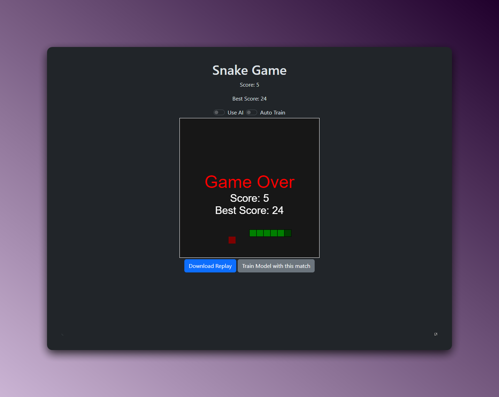

# Snake Game with AI




This is a classic Snake game implemented in JavaScript.
(The AI doesn't work)

## Features

- **Classic Snake Gameplay**: Play the traditional snake game.
- **Replay**: Save game replays to watch it later. You can also load a replay to watch it again adjusting the speed, pausing or resuming it.
- **Persistent Best Score**: Your best score is saved across sessions.

## Getting Started


### Installation

1. **Clone the repository**:
    ```bash
    git clone https://github.com/your-username/snake.git
    cd snake
    ```

2. **Run the game**:
   Open the `index.html` file in your preferred web browser.

### How to Play

- **Manual Mode**: Use the arrow keys to control the snake. Try to eat the food (red square) and grow as long as possible without hitting the walls or yourself.

### Controls

- **Arrow Keys**: Control the snake's direction.
- **Play/Pause Button**: Pause or resume the game.
- **Reset Button**: Restart the game.
- **Speed Control**: Use the dropdown to change the game speed.
- **Replay Features**:
  - **Download Replay**: Save the current game replay.
  - **Load Replay**: Load a previously saved replay.
    - **Pause/Resume Button**: Pause or resume the replay.
    - **Speed Control**: Adjust the replay speed.

